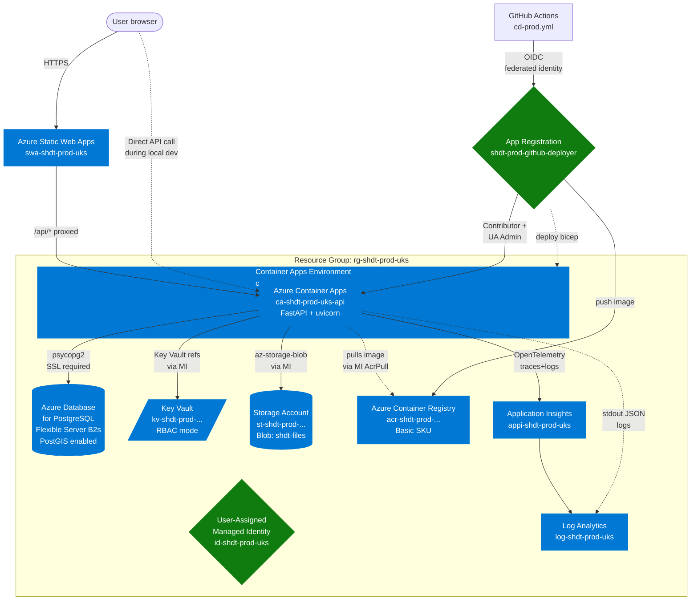

# SHDT — Target Architecture (Azure)

This document describes the production architecture for SHDT on Azure UK
South. It accompanies `AZURE_DEPLOYMENT.md` (the deploy walkthrough) and
`infra/bicep/` (the actual Bicep templates).

## High-level diagram

## Component-by-component decisions

### Backend hosting — Azure Container Apps

**Decision:** Container Apps (consumption tier), single Container App,
single revision active at a time, scale 1 → 3 replicas.

**Why not App Service or AKS:**
- App Service for Containers would work but Container Apps is cheaper at
  low load (scale-to-zero), has built-in revision-based blue/green, and
  ships with KEDA-based autoscaling out of the box.
- AKS is over-kill for this scale and would need its own platform-engineer
  attention. Revisit when SHDT has 10+ services or specific scheduling
  needs (e.g. GPU workloads for ML training).

**Sizing:** 0.5 vCPU / 1 GiB memory per replica. This fits the consumption
tier free monthly grant and is enough to comfortably serve the Strategic
Insights queries. Bumping to 1 vCPU / 2 GiB is a one-line param change
when the load justifies it.

### Frontend hosting — Azure Static Web Apps

**Decision:** Static Web Apps (Standard tier; Free works to start).

**Why:** Built-in global CDN, free SSL, custom-domain support,
PR-environment previews via the SWA GitHub integration. A static React
app does not need Container Apps.

**Constraint:** Static Web Apps is not yet GA in UK South — the SWA
resource lives in West Europe but serves your users globally via Azure's
edge CDN. Latency is fine.

### Database — Azure Database for PostgreSQL Flexible Server

**Decision:** Flexible Server, Burstable `B2s` (2 vCPU, 4 GiB), 32 GB
storage, PostGIS enabled via `azure.extensions`.

**Why Flexible Server vs Single Server:** Single Server is being retired
end of 2025; Flexible Server is the path forward. It supports more
extensions, better networking (VNet integration when you want it later),
and better backup semantics.

**Why Burstable B2s:** SHDT's query load is bursty (Strategic Insights
queries plus the occasional bulk enrichment), not sustained. Burstable
gives you the headroom for bursts without paying for steady high CPU.
Switch to General Purpose `D2ds_v5` if average CPU > 60%.

**PostGIS:** Configured via the `azure.extensions` parameter at server
create time. Other useful extensions enabled: `POSTGIS_TOPOLOGY`,
`POSTGIS_RASTER`, `UUID-OSSP`, `PG_TRGM`.

### Secrets — Azure Key Vault (RBAC mode)

**Decision:** Key Vault in RBAC mode (not access policies). Backend MI
gets `Key Vault Secrets User`. Operator gets `Key Vault Secrets Officer`
for seeding/rotation. Secrets surface to the Container App via secret
references — they appear as env vars to the running process.

**Why not just env vars:** Key Vault gives audit logs, rotation
workflows, soft-delete + purge protection, and one source of truth for
multi-environment setups later.

### File storage — Azure Storage Account + Blob

**Decision:** Storage Account v2, LRS, Hot tier, single container
`shdt-files`. Blob public access disabled. Shared key auth disabled —
forces Managed Identity / AAD auth.

**Why disabled shared keys:** Eliminates the entire class of
"connection-string-leaked" incidents. Backend authenticates via the
Managed Identity and gets a SAS URL when one is needed for downloads.

**What goes in Blob:**
- `operational/Repairs by Contractor.xlsx`
- `operational/Complaints Data 1.xlsx`
- `cache/os-open-uprn.csv`
- `cache/iod-2025.csv`
- `exports/` — generated PDFs from the board-pack feature (Phase 5)

### Identity — User-Assigned Managed Identity

**Decision:** One User-Assigned MI (`id-shdt-prod-uks`) for the backend
Container App.

**Why User-Assigned vs System-Assigned:** The lifetime of a System
Assigned identity is bound to the resource. If you rebuild the Container
App from scratch, every RBAC role assignment has to be redone. With UAM,
the identity is independent — you can move it between resources, share
it across services, and it survives accidental resource deletes.

### Observability — App Insights + Log Analytics

**Decision:** App Insights configured in workspace mode, sharing the
Log Analytics workspace with the Container Apps Environment.

**Why workspace mode:** One query language (KQL), one retention setting,
one billing line. Classic mode is being retired.

**Instrumentation:** The backend already emits structured JSON logs
(see `server/observability/logging_config.py`). Container Apps forwards
those to Log Analytics automatically. App Insights also picks up the
ASGI request traces if `APPLICATIONINSIGHTS_CONNECTION_STRING` is set
(it is, via Bicep). For richer auto-instrumentation, add
`opencensus-ext-azure` to `requirements.txt` (deferred — not a Phase 2 blocker).

### CI/CD — GitHub Actions with OIDC federated identity

**Decision:** No long-lived service-principal secrets. GitHub Actions
authenticates to Azure via OIDC federated credentials, scoped to:
- `refs/heads/main` (push deploys)
- `environment:prod` (manual workflow_dispatch)
- `pull_request` (validation runs)

**Why:** No secret rotation, smaller blast radius if a workflow is
compromised, audit trail in Entra ID.

**Handled by:** `infra/scripts/bootstrap.sh` (creates the App
Registration + federation + RBAC) and `.github/workflows/cd-prod.yml`
(uses `azure/login@v2` with OIDC).

## Non-decisions / things deferred

These are documented as "we know we'll need this eventually but not for
the first deploy":

1. **VNet integration & private endpoints.** Postgres + Storage + Key
   Vault all currently allow public network access (gated by AAD auth
   and firewall rules). Add a VNet with private endpoints for each one
   when the deployment carries customer data.

2. **Azure Front Door + WAF.** Static Web Apps already gives you a
   global CDN; Front Door adds WAF rules, custom routing and DDoS
   protection. ~£28/mo, defer until needed.

3. **Cross-region DR.** Single-region prod is fine for now. UK West is
   the natural DR pair; add a geo-replicated Postgres replica when SLA
   requires it.

4. **Multi-environment.** One prod environment to start. Add staging by
   copying `prod.bicepparam` to `staging.bicepparam` and creating a
   second workflow.

5. **Managed application user (separate from the admin login).** Today
   the Container App connects to Postgres as `shdt_admin`. Add a
   `shdt_app` role with limited grants in a future migration; the admin
   login then only runs migrations.

## Decision log (ADRs in flight)

| # | Decision | Date | Status |
|---|---|---|---|
| 1 | Use Container Apps over App Service / AKS | 2026-04-30 | Accepted |
| 2 | Use Static Web Apps for the frontend | 2026-04-30 | Accepted |
| 3 | Use Bicep over Terraform | 2026-04-30 | Accepted (Azure-native) |
| 4 | Use UK South over UK West / West Europe | 2026-04-30 | Accepted |
| 5 | One environment to start; staging later | 2026-04-30 | Accepted |
| 6 | OIDC federated identity over service-principal secrets | 2026-04-30 | Accepted |
| 7 | Burstable B2s Postgres, autogrow on | 2026-04-30 | Accepted |
| 8 | Defer VNet / private endpoints to Phase 2.1 | 2026-04-30 | Accepted |

If a decision changes, add a new entry rather than rewriting the
existing one — the historical context matters.
